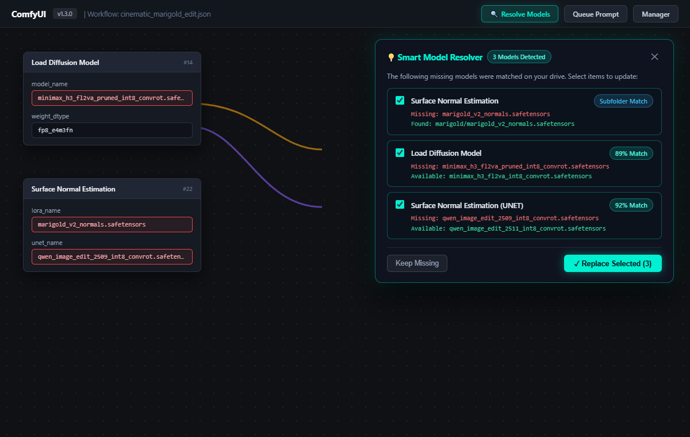
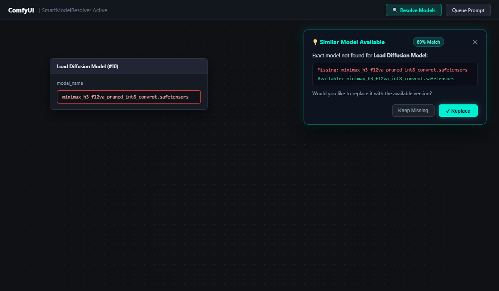
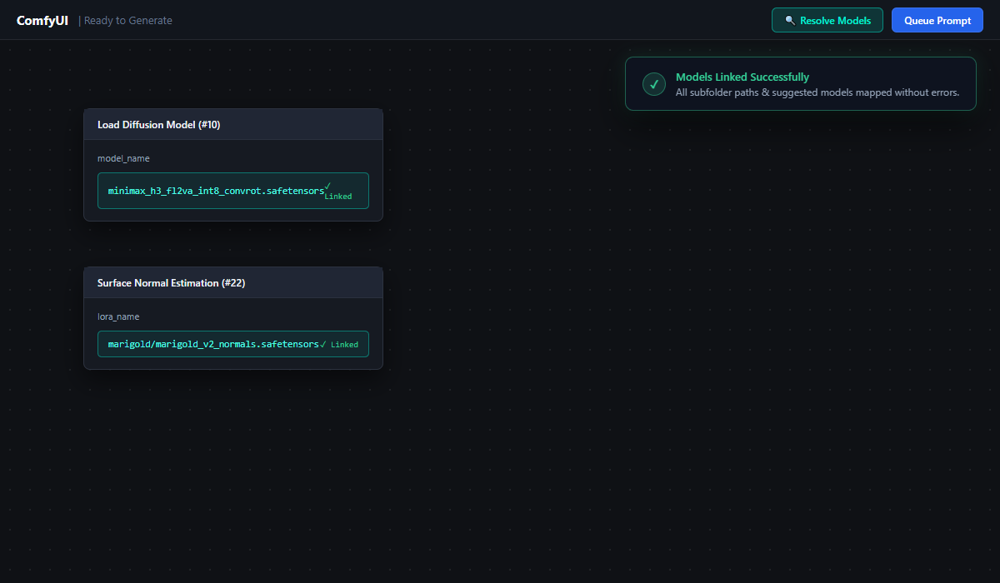

# ComfyUI-SmartModelResolver

An intelligent, lightning-fast model locator and subfolder auto-linker for **ComfyUI**.

Eliminates workflow loading failures, missing subfolder paths, and red widget errors with a modern, glassmorphic UI.

---

## 📸 Preview & Interaction

### 1. ⚡ Consolidated Batch Resolver
When opening a complex workflow with multiple missing models or subfolders, **SmartModelResolver** groups all issues into a single, non-blocking glassmorphic card. Review exact subfolder matches and similar suggestions with checkboxes, then link them all in one click:

<p align="center">
  
</p>

### 2. 💡 Intelligent Similarity Detection
When a workflow specifies a slightly different revision or naming format (e.g., `_pruned` or revision differences), the assistant highlights authentic candidates in your local library with match percentage badges:

<p align="center">
  
</p>

### 3. ✅ Seamless Canvas Linking
Selected paths are instantly mapped directly to your graph and subgraphs without reloading ComfyUI, leaving your nodes clean and ready to queue:

<p align="center">
  
</p>

---

## ✨ Features

- **🔍 Automatic Subfolder Resolution**:
  Instantly discovers and links models stored inside local subfolders.
- **💡 Smart Model Suggestions**:
  When a workflow requests a model you do not have (e.g., `minimax_h3_fl2va_pruned_int8_convrot`), the assistant detects authentic alternatives in your library (e.g., `minimax_h3_fl2va_int8_convrot` with 89%+ match) and lets you replace them in one click.
- **⚡ Consolidated Batch Resolver**:
  Groups all missing models and suggestions into a single unified card with selection checkboxes and a single-click `Replace Selected` button.
- **⚡ Blazing Fast Indexing (<50ms)**:
  Directly leverages ComfyUI's native in-memory cache system and background daemon threads with 0ms startup lag.
- **🧩 Full Subgraph / Group Node Support**:
  Recursively traverses both root graphs and inner subgraphs, keeping promoted inputs and internal definitions perfectly in sync.
- **🛡️ Strict File Protection**:
  Only matches authentic neural model formats (`.safetensors`, `.ckpt`, `.pt`, `.pth`, `.bin`, `.sft`). Never matches `.py`, `.json`, or non-model files.
---

## 🚀 Installation

1. Open a terminal inside your ComfyUI `custom_nodes` directory:
   ```bash
   git clone https://github.com/tahakhorsand/ComfyUI-SmartModelResolver.git
   ```
2. Restart ComfyUI.
3. Open any workflow. If models are in subfolders or close alternatives exist, the glassmorphic assistant will appear in the top-right corner.

---

## ⚙️ How It Works

1. **Backend Interceptor**: Transparently hooks into `folder_paths.get_full_path` to resolve paths on-the-fly during execution without breaking native ComfyUI caching.
2. **Frontend Sync**: Automatically updates node widgets across graphs and subgraphs, redrawing the canvas seamlessly.
3. **Smart Similarity Engine**: Employs token-aware string similarity to suggest genuine model revisions without false positives.

---

## 📄 License
MIT License
